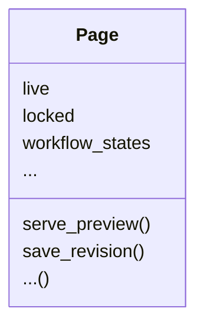
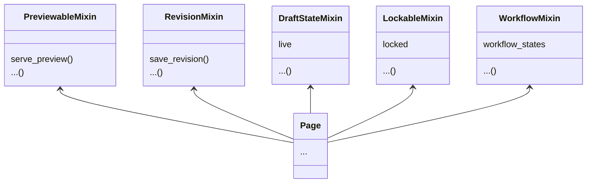

<h1 class="!text-5xl font-semibold">
✨ Modern editing experience you can build in your CMS 🐦
</h1>

<p class="!opacity-90">Sage Abdullah</p>

<div class="abs-br m-6 flex gap-2">
  <a href="https://slides.laymonage.com/fosdem-2024" target="_blank"
    class="text-xl slidev-icon-btn !py-1 opacity-50 !border-none !hover:text-white">
    slides.laymonage.com/fosdem-2024
  </a>
</div>

<!--
The last comment block of each slide will be treated as slide notes. It will be visible and editable in Presenter Mode along with the slide. [Read more in the docs](https://sli.dev/guide/syntax.html#notes)
-->

---
hideInToc: true
---

# About me

<div class="!text-2xl">

- Sage Abdullah / **@laymonage**
- **Wagtail Developer** at Torchbox
- Google Summer of Code 2019 student with Django
- Google Summer of Code & Outreachy mentor for Wagtail

</div>

<style>
  li {
    @apply !mb-3;
  }

  ul li:has(ul) {
    @apply !mb-2;
  }
</style>

<!--
Here is another comment.
-->

---
layout: default
hideInToc: true
---

# Outline

<Toc maxDepth="1"></Toc>

---
layout: image-right
image: ./images/wagtail.png
---

# Wagtail CMS

An open source content management system (CMS) built on Django.

It's built around the `Page` content type, which is stored in a tree structure
that defines the site's URLs.

Wagtail gives you the power to:
- see a live preview as you edit
- save revisions
- manage live/draft versions
- moderate your content
- and much more!

---
layout: default
hideInToc: true
---

# Tree structure of `Page`

<div class="flex gap-8 text-3xl">

```
── Home
    └── Publications
        └── My latest publication
    └── Gallery
    └── About Us
        └── Team
        └── Careers
```

```
/
/publications/
/publications/my-latest-publication/
/gallery/
/about/
/about/team/
/about/careers/
```

</div>

<style>
  .slidev-code, .shiki-container pre {
    font-size: 1.25rem !important;
    line-height: 2 !important;
  }
</style>

---
layout: default
---

# Content is **not** just about pages

You may have other "snippets" of content that are not part of the page tree.

Or, content types from a project that does not use a CMS.

```python
from django.db import models
from wagtail.snippets.models import register_snippet

@register_snippet
class Person(models.Model):
    name = models.CharField(max_length=255)
    intro = models.TextField()
    ...
```

---
layout: default
---

# The Zen of Wagtail

<v-clicks>

- Always wear the right hat.
  - designer
  - developer
  - site administrator
  - the content author
- A CMS should get information out of an editor’s head and into a database,\
  as efficiently and directly as possible.
- The best user interface for a programmer is usually a programming language.

</v-clicks>

---
layout: default
---

# Managing content types in the CMS?

<div class="flex items-center justify-center w-full">
  
</div>

[https://www.drupal.org/docs/user_guide/en/structure-fields.html](https://www.drupal.org/docs/user_guide/en/structure-fields.html)

---
layout: default
hideInToc: true
---

# Content types in Wagtail

Developers have complete control over the content types and their fields – in the code.

```py
class BlogPage(Page):
    introduction = models.TextField(help_text="Text to describe the page", blank=True)
    image = models.ForeignKey("wagtailimages.Image", ...)
    body = StreamField(BaseStreamBlock(), verbose_name="Page body", ...)
    subtitle = models.CharField(blank=True, max_length=255)
    author = models.ForeignKey("myapp.Person", ...)
    ...


@register_snippet
class Person(models.Model):
    name = models.CharField(max_length=255)
    intro = models.TextField()
    ...
```

---
layout: default
transition: fade
---

# Features



---
layout: default
level: 2
---

# Features



---
layout: image-right
image: ./images/preview.png
transition: none
---

# Live preview

To help editors see how their changes will look on the live site, developers can define preview modes.

```python
from wagtail.models import PreviewableMixin


@register_snippet
class Product(PreviewableMixin, models.Model):
    preview_modes = [
        ("index", "Index"),
        ("detail", "Detail"),
    ]

    def get_preview_template(self, request, preview_mode):
        return f"products/{preview_mode}.html"

    def get_preview_context(self, request, preview_mode):
        if preview_mode == "index":
            return {"products": [self]*20}
        return {"product": self}
```

<style>
  .grid-cols-2 {
    grid-template-columns: 4fr 3fr !important;
  }
</style>

---
layout: image-right
image: ./images/preview-alt.png
hideInToc: true
transition: none
---

# Live preview

To help editors see how their changes will look on the live site, developers can define preview modes.

```python
from wagtail.models import PreviewableMixin


@register_snippet
class Product(PreviewableMixin, models.Model):
    preview_modes = [
        ("index", "Index"),
        ("detail", "Detail"),
    ]

    def get_preview_template(self, request, preview_mode):
        return f"products/{preview_mode}.html"

    def get_preview_context(self, request, preview_mode):
        if preview_mode == "index":
            return {"products": [self]*20}
        return {"product": self}
```

<style>
  .grid-cols-2 {
    grid-template-columns: 4fr 3fr !important;
  }
</style>

---
layout: image-right
image: ./images/preview.png
hideInToc: true
---

# Live preview

How we built it:

<v-clicks>

- Check the form for changes
- Submit it to the server
- Reload the preview iframe with the new content
- Issue: flashing iframe on reload
- Solution: create a new invisible iframe, swap it when it finishes loading

</v-clicks>

<style>
  .grid-cols-2 {
    grid-template-columns: 4fr 3fr !important;
  }
</style>

---
layout: default
transition: none
---

# Revisions

Add versioning to your content type by extending the `RevisionMixin` class.

```python
from wagtail.models import RevisionMixin

...
class Product(RevisionMixin, PreviewableMixin, models.Model):
    ...
```


---
layout: default
hideInToc: true
---

# Revisions

You can compare revisions and revert to a previous version.

<div class="flex items-center justify-center w-full mt-4">
  
</div>

---
layout: image-right
image: ./images/save-draft-publish.png
transition: none
---

# "Draft" changes

Use `DraftStateMixin` to have the ability to save unpublished changes (**drafts**).

```python
from wagtail.models import DraftStateMixin

...
class Product(DraftStateMixin, RevisionMixin, PreviewableMixin, models.Model):
    ...
```

Unpublished changes are saved as revisions and will not be reflected to the live content until you publish them.

<style>
  .grid-cols-2 {
    grid-template-columns: 4fr 3fr !important;
  }
  .grid-cols-2 :last-child {
    background-size: contain !important;
  }
</style>

---
layout: default
hideInToc: true
---


# "Draft" changes

Drafts can be scheduled to be published at a later time.

<div class="flex items-center justify-center w-full mt-8">
  
</div>


<style>
  .grid-cols-2 {
    grid-template-columns: 4fr 3fr !important;
  }
  .grid-cols-2 :last-child {
    background-size: contain !important;
  }
</style>

---
layout: image-right
image: ./images/locking.png
---

# Locking

You can prevent multiple users from editing the same content at the same time by using the `LockableMixin` class.

```python
from wagtail.models import LockableMixin

...
class Product(
    DraftStateMixin,
    LockableMixin,
    RevisionMixin,
    PreviewableMixin,
    models.Model,
):
    ...
```

<style>
  .grid-cols-2 {
    grid-template-columns: 3fr 2fr !important;
  }
  .grid-cols-2 :last-child {
    background-size: contain !important;
  }
</style>

---
layout: image-right
image: ./images/workflow.png
transition: none
---

# Workflows

If `WorkflowMixin` is enabled, you can define workflows for your content types.

Workflows can be used to moderate content changes before they go live.

```python
from wagtail.models import WorkflowMixin

...
class Product(
    WorkflowMixin,
    DraftStateMixin,
    LockableMixin,
    RevisionMixin,
    PreviewableMixin,
    models.Model,
):
    ...
```

<style>
  .grid-cols-2 {
    grid-template-columns: 2fr 1fr !important;
  }
  .grid-cols-2 :last-child {
    background-size: contain !important;
  }
</style>

---
layout: image-right
image: ./images/workflow-status.png
hideInToc: true
---

# Workflows

A workflow is a series of tasks (stages) that a piece of content must go through before a final goal (e.g. publishing) is reached.

Developers can write custom "task types" to define the conditions and actions for each task.

```python
class GroupApprovalTask(Task):
    groups = models.ManyToManyField(Group, ...)

    def get_actions(self, obj, user):
        ...

    def on_action(task_state, user, action_name, **kwargs):
        ...

    ...
```

<style>
  .grid-cols-2 {
    grid-template-columns: 2fr 1fr !important;
  }
  .grid-cols-2 :last-child {
    background-size: contain !important;
  }
</style>

---
layout: default
---

# Accessibility checker

An accessibility checker is built-in to the page editor, powered by `axe-core`.

It checks the content for common accessibility issues and suggests improvements.

<div class="flex items-center justify-center w-full mt-8">


</div>

---
layout: default
---

# Did somebody say AI?

An optional package, `wagtail-ai`, provides AI-powered features in the CMS.

<div class="flex items-center justify-center w-full mt-8">
  <video width="600" src="/images/wagtail-ai-demo.mp4" controls loop autoplay muted></video>
</div>

---
layout: center
class: text-center
hideInToc: true
---

# Thank you!

Learn more at [wagtail.org](https://wagtail.org)

Slides available at [slides.laymonage.com/fosdem-2024](https://slides.laymonage.com/fosdem-2024/)

Wagtail AI webinar on February 7th: [wagtail.org/wagtail-ai](https://wagtail.org/wagtail-ai/)

Reach out to [me@laymonage.com](mailto:me@laymonage.com)
