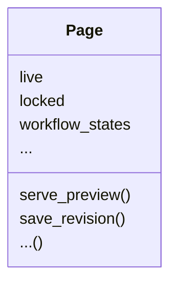
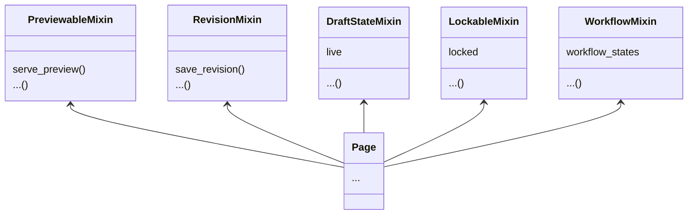

<h1 class="!text-5xl font-semibold">
✨ Modern editing experience for your Django models with Wagtail 🐦
</h1>

<p class="!opacity-90">Sage Abdullah</p>

<div class="abs-br m-6 flex gap-2">
  <a href="https://slides.laymonage.com/integrate-wagtail" target="_blank"
    class="text-xl slidev-icon-btn !py-1 opacity-50 !border-none !hover:text-white">
    slides.laymonage.com/integrate-wagtail
  </a>
</div>

<!--
The last comment block of each slide will be treated as slide notes. It will be visible and editable in Presenter Mode along with the slide. [Read more in the docs](https://sli.dev/guide/syntax.html#notes)
-->

---
hideInToc: true
---

# About me

<div class="!text-2xl">

- Sage Abdullah / **@laymonage**
- **Wagtail Developer** at Torchbox
- Google Summer of Code 2019 student with Django
  - Cross-database **`JSONField`**
- Google Summer of Code & Outreachy mentor for Wagtail

</div>

<style>
  li {
    @apply !mb-3;
  }

  ul li:has(ul) {
    @apply !mb-2;
  }
</style>

<!--
Here is another comment.
-->

---
layout: default
hideInToc: true
---

# Outline

<Toc maxDepth="1"></Toc>

---
layout: image-right
image: ./images/wagtail.png
---

# Wagtail CMS

An open source content management system (CMS) built on Django.

The `Page` model acts as both "model" and "view". The tree structure of the model is reflected in your website's URL structure.

Wagtail gives you the power to:
- see a live preview as you edit
- save revisions
- manage live/draft versions
- moderate your content
- and much more!

---
layout: default
transition: fade
---

# Features



---
layout: default
level: 2
---

# Features



---
layout: default
---

# Integrating Wagtail

- Install
  ```shell
  python -m pip install wagtail
  ```
- Add to `INSTALLED_APPS`
- Add middleware to `MIDDLEWARES`
- Add URLs to `urls.py`
- Run the migrations
- Hack away!

---
layout: iframe
url: https://docs.wagtail.org/en/stable/getting_started/integrating_into_django.html
---

---
layout: default
---

# Registering your models

Wagtail primarily works with its `Page` model. For other models, you can register them as "snippets".

Add a `@register_snippet` decorator to your model and specify the editable fields using `panels`.

```python
from wagtail.admin.panels import FieldPanel
from wagtail.snippets.models import register_snippet

@register_snippet
class Person(models.Model):
    name = models.CharField(max_length=255)
    description = models.TextField()
    ...

    # Optional, but allows you to fine-tune the editable fields and their order
    panels = [
        FieldPanel("name"),
        FieldPanel("description"),
        ...
    ]
```

---
layout: image-right
image: ./images/preview.png
---

# Enabling live preview

<div v-click="[0, 1]">

The preview feature comes from the `PreviewableMixin` class.

To use it, add it as a superclass to your model. Then, override the `get_preview_template` and `get_preview_context` methods.

```python
from wagtail.models import PreviewableMixin


@register_snippet
class Product(PreviewableMixin, models.Model):
    ...

    def get_preview_template(self, request, preview_mode):
        return f"products/detail.html"

    def get_preview_context(self, request, preview_mode):
        return {"product": self}
```

</div>

<div v-after>

You can define different preview modes using the `preview_modes` attribute.

```python
...
class Product(PreviewableMixin, models.Model):
    ...

    preview_modes = [
        ("index", "Index"),
        ("detail", "Detail"),
    ]

    def get_preview_template(self, request, preview_mode):
        return f"products/{preview_mode}.html"

    def get_preview_context(self, request, preview_mode):
        if preview_mode == "index":
            return {"products": [self]*20}
        return {"product": self}
```

</div>

<style>
  .slidev-vclick-hidden {
    display: none;
  }
  .grid-cols-2 {
    grid-template-columns: 4fr 3fr !important;
  }
</style>

---
layout: default
---

# Enabling revisions

You can have revisions for your model by extending the `RevisionMixin` class.

```python
from wagtail.models import RevisionMixin

...
class Product(RevisionMixin, PreviewableMixin, models.Model):
    ...
```

Then, create and and run the migrations.

```shell
python manage.py makemigrations
python manage.py migrate
```

This allows you to **compare** the changes between revisions and **revert** to a previous revision.

---
layout: image-right
image: ./images/save-draft-publish.png
transition: none
---

# Enabling "draft" changes

Wagtail allows you to save unpublished changes (**"drafts"**) of your models. This functionality is provided by the `DraftStateMixin`.

```python
from wagtail.models import DraftStateMixin

...
class Product(DraftStateMixin, RevisionMixin, PreviewableMixin, models.Model):
    ...
```

After creating and running the migrations, you can make use of the `live` field of the model.

```python
Product.objects.filter(live=True)
```

Unpublished changes are saved as `Revision`s and will not be reflected to your model's instance until you publish them.

<style>
  .grid-cols-2 {
    grid-template-columns: 4fr 3fr !important;
  }
  .grid-cols-2 :last-child {
    background-size: contain !important;
  }
</style>

---
layout: image-right
image: ./images/scheduled-publishing.png
hideInToc: true
---


# Enabling "draft" changes

To enable the scheduled publishing feature, add the `PublishingPanel` to your model's `panels`.

```python
from wagtail.admin.panels import PublishingPanel

...
class Product(DraftStateMixin, RevisionMixin, PreviewableMixin, models.Model):
    ...

    panels = [
        ...
        PublishingPanel(),
    ]
```

<style>
  .grid-cols-2 {
    grid-template-columns: 4fr 3fr !important;
  }
  .grid-cols-2 :last-child {
    background-size: contain !important;
  }
</style>

---
layout: image-right
image: ./images/locking.png
---

# Enabling locking

You can prevent multiple users from editing the same model instance at the same time by using the `LockableMixin` class.

```python
from wagtail.models import LockableMixin

...
class Product(
    DraftStateMixin,
    LockableMixin,
    RevisionMixin,
    PreviewableMixin,
    models.Model,
):
    ...
```

After making and running the migrations, Wagtail will give you the option to lock the model instance.

<style>
  .grid-cols-2 {
    grid-template-columns: 3fr 2fr !important;
  }
  .grid-cols-2 :last-child {
    background-size: contain !important;
  }
</style>

---
layout: image-right
image: ./images/workflow.png
transition: none
---

# Enabling workflows

Wagtail allows you to define workflows for your models, which can be used to moderate content changes before they go live. This functionality is provided by the `WorkflowMixin` class.

```python
from wagtail.models import WorkflowMixin

...
class Product(
    WorkflowMixin,
    DraftStateMixin,
    LockableMixin,
    RevisionMixin,
    PreviewableMixin,
    models.Model,
):
    ...
```

<style>
  .grid-cols-2 {
    grid-template-columns: 2fr 1fr !important;
  }
  .grid-cols-2 :last-child {
    background-size: contain !important;
  }
</style>

---
layout: image-right
image: ./images/workflow-status.png
hideInToc: true
---

# Enabling workflows

By default, Wagtail gives you the "Moderators approval" workflow, which requires a moderator to approve the changes before they go live.

You can create custom workflows with custom tasks to suit your specific needs.

<style>
  .grid-cols-2 {
    grid-template-columns: 2fr 1fr !important;
  }
  .grid-cols-2 :last-child {
    background-size: contain !important;
  }
</style>

---
layout: center
class: text-center
hideInToc: true
---

# Thank you!

[wagtail.org](https://wagtail.org)

<span class="text-sm opacity-50">Thanks to Storm and Thibaud for helping with ideas for this talk!</span>
